[🇰🇷 한국어 (Korean)](#korean) | [🇺🇸 English](#english)

# 🛡️ 디아블로 2: 레저렉션 다기능 유틸리티 오버레이 (D2R Utility Overlay - DUO)

디아블로 2: 레저렉션 플레이를 더욱 쾌적하게 만들어주는 **다기능 유틸리티 오버레이(DUO)** 프로그램입니다. 기존의 **다음 공역(Terror Zone)** 및 **우버디아(Diablo Clone)** 실시간 추적 기능은 물론, 사용자 맞춤형 **버프 스킬 타이머** 및 **실시간 아이템 사전 검색** 등 게임에 유용한 다양한 편의 기능들을 화면 위에 실시간으로 제공합니다.

> **📢 알림:** 기능이 많아지면서 하나하나 테스트하는 데 시간이 많이 소요되고 있습니다. (예: 테러존 API 갱신 테스트 시 최소 30분 대기 등) 따라서 일부 버그나 미흡한 점이 있더라도 너그럽게 양해 부탁드립니다. 저 또한 게임 플레이 시 이 프로그램을 항상 사용하고 있으므로, 오류를 발견하는 대로 최대한 빠르게 수정하여 업데이트하겠습니다! [👉 개발자에게 피드백 및 도움 주러 가기](#support-kr)

---

## 📑 목차 (Table of Contents)
* [📸 스크린샷 (Screenshots)](#screenshots-kr)
* [🚀 시작하기 (Quick Start)](#getting-started-kr)
* [⌨️ 단축키 안내 (Hotkeys)](#hotkeys-kr)
* [✨ 주요 기능 (Key Features)](#features-kr)
* [💡 커스텀 꿀팁 (Custom Tips)](#custom-tips-kr)
* [📂 파일 및 폴더 설명](#files-kr)
* [💻 테스트 환경 및 주의사항 (Troubleshooting)](#environment-kr)
* [☕ 피드백 & 후원하기 (Contact & Support)](#support-kr)

---

## 📸 스크린샷 (Screenshots)

### 1. 테러존 & 우버디아 오버레이
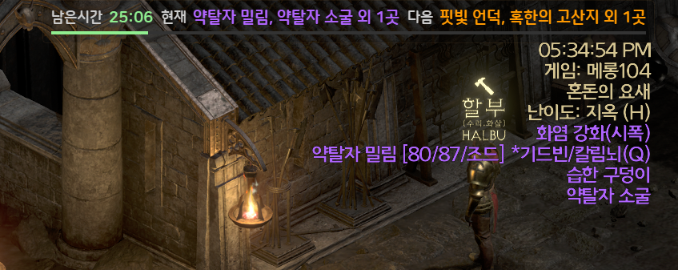
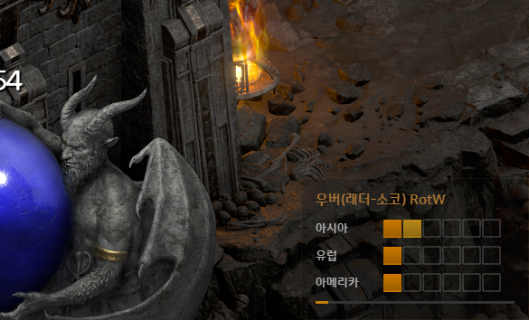
> 화면 상단에 다음 공역 정보 및 남은 시간을, 우측 하단에 대륙별 우버디아 진행도를 직관적인 블록(`■■■□□□`)으로 표시합니다.

### 2. 사용자 맞춤형 버프 오버레이 및 프로필 관리
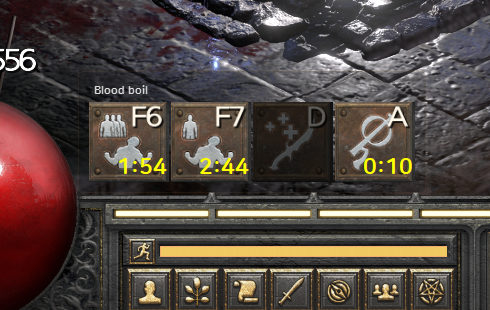
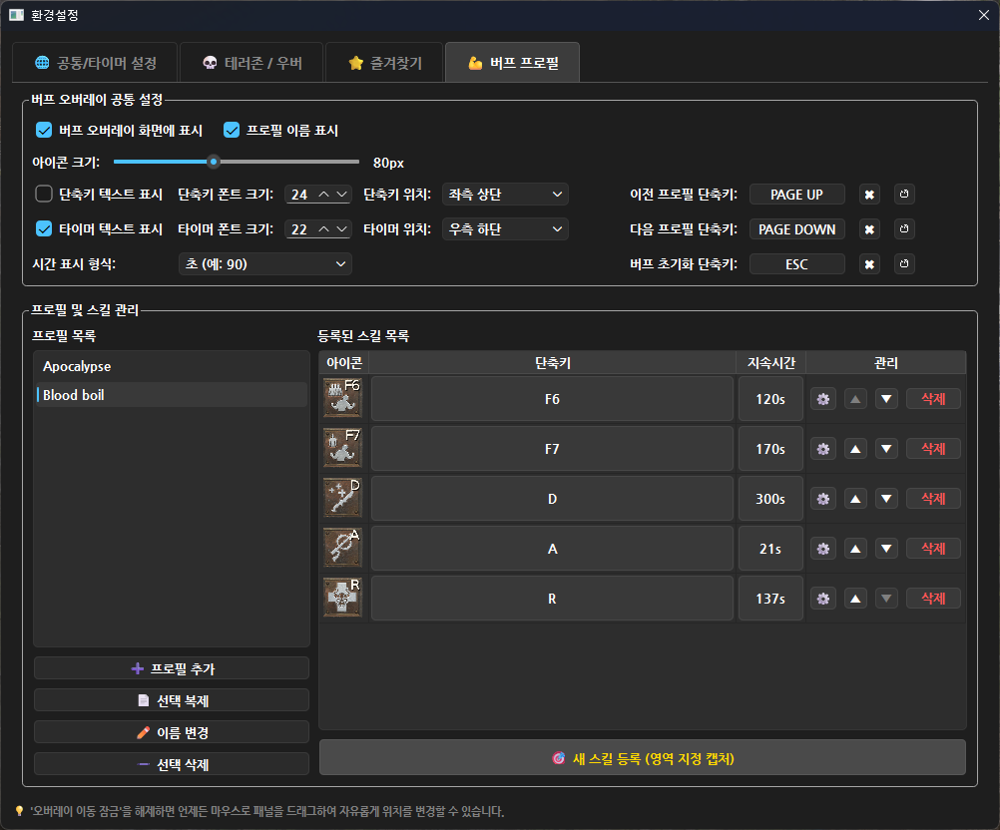
> 내가 원하는 스킬 아이콘을 직접 캡처하여 버프 지속 시간을 설정하고 관리할 수 있습니다. 직관적인 설정 화면에서 캐릭터나 빌드별로 프로필을 나누어 스킬을 그룹화해 보세요.

### 3. 실시간 아이템 사전 검색
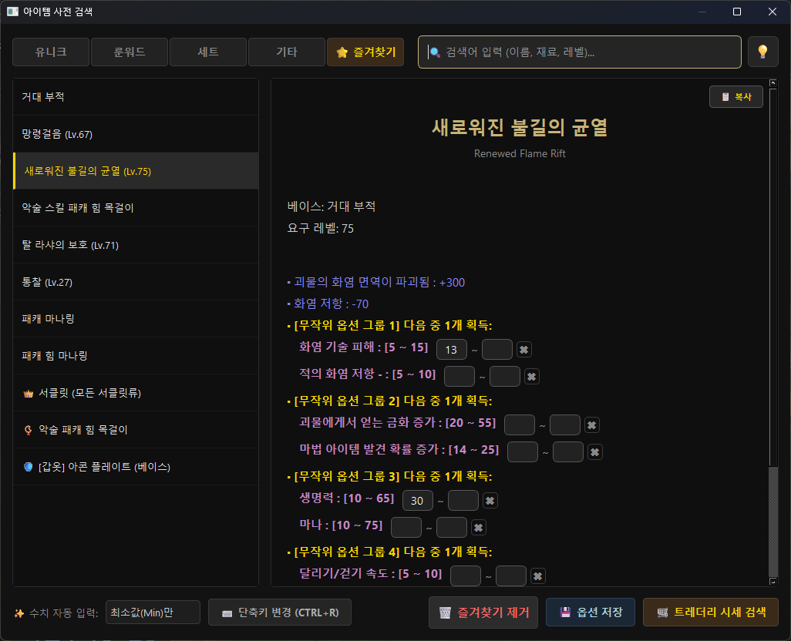
> 게임 내에서 바로 유니크/룬워드 아이템의 옵션, 재료, 별칭 등을 검색하고 트레더리(Traderie) 시세까지 즉시 확인할 수 있습니다.

### 4. 스피드런 타이머 (Speedrun Timer)
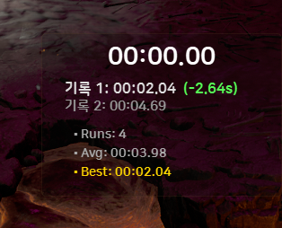
> 장비 교체나 빌드 변경 후 클리어 타임이 얼마나 단축되었는지 직관적으로 비교하고 상세 통계를 기록할 수 있습니다.

---

## 🚀 시작하기 (Quick Start)

### 1. 다운로드 및 준비
1. 우측 **Releases** 메뉴에서 최신 버전의 **`.zip` 파일**을 다운로드 후 압축을 풉니다.
2. 원활한 데이터 수신을 위해 [d2tz.info 회원가입/로그인](https://www.d2tz.info/login) 후 **User Profile**에서 개인 **API Key(Token)** 를 복사합니다.

> **💡 버전 업데이트 시 기존 설정 유지 방법**
> * **자동 업데이트 (권장):** 프로그램 실행 시 최신 버전 알림이 뜨면 하단의 **`⚡ 자동 업데이트`** 버튼을 클릭하세요. 기존 설정(UI 위치, 폰트, 프로필 등)이 모두 유지된 채 안전하게 자동 설치 및 재실행됩니다.
> * **수동 업데이트:** 깃허브에서 새 버전을 직접 다운로드할 경우, 기존에 쓰던 폴더에서 `d2_overlay_config.json`, `profiles` 폴더를 복사하여 새 버전 폴더에 덮어쓰기 하시면 됩니다.

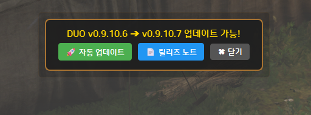
> 💡 새 버전이 감지되면 화면 상단에 **`⚡ 자동 업데이트`** 버튼이 나타납니다.

### 2. 실행 및 설정
1. **디아블로 2: 레저렉션**을 실행합니다. (전체화면 모드 권장)
2. `DUO.exe` 파일을 실행합니다. *(게임 클라이언트를 관리자 권한으로 실행했다면 이 프로그램도 관리자 권한으로 실행해야 합니다.)*
3. 단축키 **`Ctrl` + `Shift` + `S`** 를 누르거나 시스템 트레이(우측 하단 시계 옆) 아이콘을 우클릭하여 **`⚙️ 환경설정`** 창을 엽니다.
4. 환경설정 창에 복사한 **API Key(Token)** 를 붙여넣고 언어, 폰트, 오버레이 위치 등 입맛에 맞게 세팅합니다.

---

## ⌨️ 단축키 안내 (Hotkeys)

오버레이를 더욱 빠르고 편리하게 제어하기 위한 단축키입니다. (단축키는 환경설정에서 변경 가능)

| 구분 | 단축키 | 기능 설명 |
| :--- | :---: | :--- |
| **공통 설정** | `Ctrl` + `Shift` + `S` | 환경설정 창 즉시 열기 (게임 중) |
| **아이템 검색** | `Ctrl` + `F` | 아이템 사전 검색창 열기 |
| | `Tab` | (검색창 내) 유니크 / 룬워드 탭 전환 |
| | `↑` / `↓` | (검색창 내) 검색 결과 상하 이동 |
| | `ESC` | 검색창 닫기 |
| **아이템 자동 인식** | `Ctrl` + `R` | 아이템 자동 인식 영역 캡쳐 시작 |
| **버프 타이머** | `PageUp` / `PageDown` | 버프 스킬 프로필 전환 |
| | 사용자가 설정한 키 | 지정한 버프 타이머 실행 |
| **스피드런 타이머** | `Home` | 타이머 시작 / 일시정지 |
| | `End` | 기록 완료 (현재 소요 시간 저장) |
| | `Shift` + `Del` | 전체 기록 및 통계 초기화 |

---

## ✨ 주요 기능 (Key Features)

**1. 테러존 & 우버디아 트래킹**
* **스마트 즐겨찾기 알림:** 원하는 공역 지정 시 발견 즉시, 그리고 시작 5분 전에 텍스트 깜빡임 및 소리로 알려줍니다.
* **우버디아 맞춤 알림:** 확장팩(LoD/RotW) 선택이 가능하며 단계 상승 시 소리 알림을 제공합니다.
* **초절전 스마트 폴링:** 트래픽 낭비 방지를 위해 갱신이 필요한 시점에만 API를 정교하게 호출합니다.

**2. 실시간 아이템 사전 검색**
* **강력하고 유연한 다중 검색:** 영문/한글 공식 명칭은 물론, **베이스 아이템**, 룬워드에 들어가는 **조합 룬**, 유저들이 자주 쓰는 **별칭**(예: '샤코', '오심') 등을 **띄어쓰기로 자유롭게 조합하여 검색**할 수 있습니다. 예를 들어 검색창에 여러 단어를 띄어 적으면 해당 조건이 모두 포함된 아이템만 빠르게 압축하여 찾아줍니다.
* **트레더리(Traderie) 완벽 연동 및 맞춤 즐겨찾기:** 버튼 한 번으로 선택한 아이템의 트레더리 시세 페이지를 엽니다. 변동 옵션 수치를 입력란에 적고 검색하면 해당 값이 트레더리 검색 조건으로 자동 적용됩니다. **또한, 이렇게 설정한 변동 옵션 수치를 '즐겨찾기'에 등록해두면 매번 옵션을 다시 입력할 필요 없이 즐겨찾기 탭에서 언제든 클릭 한 번으로 당시 설정된 옵션 그대로의 실시간 트레더리 시세를 빠르게 확인할 수 있습니다.** (버튼을 우클릭하여 선호하는 브라우저를 기본으로 고정 가능)
* **고급 즐겨찾기 관리:** 즐겨찾기 목록에서 항목을 **우클릭하여 이름을 변경하거나 복제**할 수 있습니다. 또한, 이미 등록된 즐겨찾기의 옵션 수치를 변경한 후 하단의 **[💾 옵션 저장]** 버튼을 눌러 손쉽게 데이터를 업데이트할 수 있습니다.
* **편의성:** 검색된 세부 옵션을 바로 클립보드에 복사할 수 있으며, 검색창이 포커스를 잃으면 자동으로 반투명해져 게임 플레이를 방해하지 않습니다.

**3. 강력한 버프 오버레이**
* **프로필 및 스킬 관리:** 캐릭터나 빌드별로 다수의 버프 프로필을 생성·복제할 수 있으며, 게임 화면 내 스킬 아이콘을 직접 캡처하여 쉽게 단축키와 지속시간을 등록할 수 있습니다.
* **스마트 버프 초기화 무시:** 창을 닫기 위해 누른 단축키(예: ESC) 때문에 버프 타이머까지 함께 초기화되는 것을 방지합니다. 인벤토리나 파티창 단축키 등을 '초기화 키 무시할 직전 키'로 등록해두면, 창을 열고 닫을 때 원치 않는 버프 초기화가 일어나지 않아 더욱 쾌적하게 게임을 즐길 수 있습니다. (토글 방식의 단축키 연속 2회 입력 시 무시 상태 자동 해제 지원)
* **디테일한 시각 효과:** 아이콘 크기, 타이머 및 단축키 텍스트의 크기와 표시 위치, 시간 표시 형식(초 또는 분 단위)을 내 입맛에 맞게 자유롭게 커스텀할 수 있습니다.
* **커스텀 알림음:** 기본 음원 외에 `sounds` 폴더에 원하는 파일(`.wav`, `.mp3`)을 넣어 스킬별로 개별 알림음과 볼륨, 깜빡임 경고 시작 시간을 지정할 수 있습니다.

**4. 스피드런 타이머 (Speedrun Timer)**
* **기록 비교 및 통계:** 장비 교체나 빌드 변경에 따른 클리어 타임 변화를 측정하는 데 최적화되어 있습니다. 직전 런 대비 시간 단축/지연 여부를 색상(+/-)으로 직관적으로 보여줍니다.
* **실시간 상세 데이터:** 현재 진행 시간뿐만 아니라 누적 실행 횟수(Runs), 평균 소요 시간(Avg), 최고 기록(Best) 등의 통계를 화면 늘어남 없이 고정된 UI로 깔끔하게 제공합니다.

**5. 완벽한 게임 통합 & UI 편의성**
* **클릭 관통 (Click-through):** 오버레이가 마우스 클릭을 방해하지 않습니다.
* **자동 숨김 & 창 모드 지원:** 게임 창이 활성화되었을 때만 표출되며, 멀티 로더 환경도 완벽하게 지원합니다.
* **자유로운 레이아웃:** 드래그 앤 드롭으로 패널 위치를 조정할 수 있고 세로 배치 모드도 지원합니다.
* **자동 업데이트:** 최신 버전 감지 시 UI 하단에 릴리즈 노트 확인 및 자동 업데이트 버튼이 나타납니다.

---

## 💡 커스텀 꿀팁 (Custom Tips)
* **폰트 변경:** `fonts` 폴더 내에 폰트 파일을 넣으시면 환경설정에서 선택하여 적용할 수 있습니다.
* **알림음 변경:** `sounds` 폴더에 원하는 음원 파일(`.wav`, `.mp3`)을 넣으시면 알림음 설정 시 선택하여 적용할 수 있습니다.
* **프로필 복사 및 공유:** `profiles` 폴더 내에 직접 생성한 버프 프로필들이 저장됩니다. 게임 내에서도 프로필 복제 기능이 제공되지만, 이 폴더를 통째로 복사해서 다른 분들과 편하게 공유하거나 안전하게 백업하실 수 있습니다.

---

## 📂 파일 및 폴더 설명

| 파일/폴더명 | 설명 |
| :--- | :--- |
| `DUO.exe` | 프로그램 메인 실행 파일 |
| `act_map.json` | ⚠️ 테러존 지역 레벨(지옥 난이도) 및 Act 분류 필수 데이터 (삭제 금지) |
| `area.json` | ⚠️ 테러존 다국어 번역 필수 데이터 (삭제 금지) |
| `d2_overlay_config.json` | 사용자 환경설정 저장 파일 (자동 생성) |
| `profiles/` | 캡처한 버프 스킬 아이콘 및 설정(`skills.json`)이 저장되는 폴더 |
| `sounds/` | 버프 종료 임박 시 사용할 사용자 지정 알림음 보관 폴더 |
| `item/data/` | 아이템 사전 검색에 사용되는 데이터베이스 파일(`.json`, `.tsv`) 보관 폴더 |
| `fonts/` | 폰트 폴더 (현재 배포 저작권 문제가 없는 폰트 파일만 추가되어 있습니다. 원하시는 폰트를 직접 추가해서 사용하세요.) |
| `models/` | 아이템 자동인식에 필요한 모듈들이 저장되는 폴더 |

---

> **⚖️ 오픈소스 라이선스 고지:**
> * 본 프로그램은 LGPLv3 라이선스를 따르는 **PySide6**를 동적 링크하여 사용하고 있습니다. 단일 실행 파일(`.exe`) 배포 특성상 라이브러리 교체를 위한 재링크(Relink)를 원하시는 분은 하단의 연락처(이메일)로 요청해 주시면 빌드용 오브젝트 파일(Object File)을 제공해 드립니다.
> * 게임 화면 내 텍스트 인식(OCR)을 위해 Apache 2.0 라이선스를 따르는 **Tesseract OCR** 및 **pytesseract**를 사용하고 있습니다.

---

## 💻 테스트 환경 및 주의사항 (Troubleshooting)

이 프로그램은 아래의 환경에서 개발 및 테스트되었습니다. 사용자 환경에 따라 약간의 차이가 있을 수 있습니다.
* **OS:** Windows 11 Pro 25H2 (64-bit)
* **Display:** 2560x1440 (QHD)
* **Game:** 디아블로 2: 레저렉션 (주로 전체화면 모드에서 테스트하며 창모드도 병행. 권장: 전체화면 모드)
* **Build:** Python 3.12 (PySide6)

**🛡️ 백신 오탐지(False Positive) 대처 안내**
이 프로그램은 게임 내 단축키 감지를 위해 `keyboard` 모듈을 사용합니다. 이로 인해 Windows Defender를 비롯한 일부 백신 프로그램이 이를 악성 코드로 오인하여 실행을 차단하거나 파일을 삭제할 수 있습니다. 
*(쉬운 설명: 키보드 입력을 가로채는 기능은 해킹 프로그램들이 자주 쓰는 방식이라 백신이 일단 의심하고 차단하는 자연스러운 현상입니다.)*

주로 다음과 같은 진단명으로 오탐지될 수 있습니다:
* **Windows Defender:** `Program:Win32/Contebrew.A!ml` *(쉬운 설명: 진단명 끝의 '!ml'은 머신러닝(Machine Learning) 기반 탐지를 의미합니다. 명확한 악성코드라기보다는 프로그램의 작동 방식을 AI가 기계적으로 분석해 예방 차원에서 차단했을 확률이 높습니다.)*
* **기타 백신 프로그램:** `Gen:Variant.Adware.Tedy.8867` 등

만약 실행이 차단되거나 프로그램 파일이 사라진다면 아래의 방법들을 적용해 보세요:

1. **백신 검사 제외 대상 등록 (권장):** 압축을 푼 DUO 프로그램 폴더 전체를 백신의 '검사 제외 항목(예외 처리)'으로 등록해 주세요.
2. **스마트 앱 컨트롤 해제:** Windows 11의 **스마트 앱 컨트롤(Smart App Control)** 기능이 켜져 있다면 이를 해제해야 정상적으로 실행 가능합니다.
3. **신뢰할 수 있는 경로에서 실행:** 바탕화면이나 다운로드 폴더 대신, `C:\Users\사용자이름\AppData\Local` 또는 `C:\Program Files` 하위에 새 폴더를 만들고 그곳에 압축을 풀어 실행하시면 시스템 관리 폴더로 인식되어 오탐지 확률을 줄일 수 있습니다.
4. **GitHub Star 누르기:** 배포 중인 GitHub 레포지토리에 별(Star) ⭐을 많이 눌러주시면, 프로그램의 사용자 신뢰도 지표가 높아져 장기적으로 스마트스크린 등의 오탐지를 줄이는 데 도움이 될 수 있습니다.

---

## ☕ 피드백 & 후원하기 (Contact & Support)

### 💡 버그 신고 및 기능 제안 (Feedback)
프로그램 사용 중 발생하는 **버그(문제)** 나 **새로운 기능 제안**은 언제든지 환영합니다! 아래의 편한 방법으로 알려주세요.
* **GitHub Issues (권장):** [이슈 페이지(클릭)](https://github.com/ggeonu-abi/D2RUO/issues)에 글을 남겨주시면 개발자가 가장 빠르고 체계적으로 확인하고 처리 상태를 추적할 수 있습니다.
* **이메일 문의:** GitHub 사용이 익숙하지 않으시다면 `miabohoja1@gmail.com` 으로 편하게 메일 보내주셔도 좋습니다.

### ☕ 후원하기 (Donation)
**본 프로그램은 누구나 무료로 자유롭게 사용할 수 있습니다!** 만약 이 프로그램이 게임 플레이에 큰 도움이 되셨다면, 향후 지속적인 업데이트와 더 좋은 기능 개발을 위해 커피 한 잔의 여유를 선물해 주시면 큰 힘이 됩니다!

* [👉 카카오페이로 커피 한 잔 후원하기 (모바일 환경에서 링크 클릭)](https://qr.kakaopay.com/FTeinPf5n9c405794)

> PC 환경이신 경우, 아래의 QR 코드를 스마트폰 기본 카메라나 카카오톡 스캔 기능으로 찍어주세요!

---

   

---

# 🛡️ Diablo 2: Resurrected Utility Overlay (DUO)

[⬆️ Back to Top / 한국어](#korean)

A **multi-purpose utility overlay (DUO)** designed to comprehensively enhance your Diablo 2: Resurrected gameplay. In addition to real-time tracking for the upcoming **Terror Zone** and **Diablo Clone** progression across servers, it provides various quality-of-life utilities, such as a highly customizable **Buff Skill Timer** and an **In-game Item Search Dictionary**, directly on your game screen.

> **📢 Notice:** As the number of features continues to grow, testing each one takes a considerable amount of time. Therefore, please be understanding if you encounter any minor bugs. Since I also actively use this program for my own gameplay, I will make sure to fix any discovered errors as quickly as possible! [👉 Go to Feedback & Support](#support-en)

---

## 📑 Table of Contents
* [📸 Screenshots](#screenshots-en)
* [🚀 Getting Started](#getting-started-en)
* [⌨️ Hotkeys](#hotkeys-en)
* [✨ Key Features](#features-en)
* [💡 Custom Tips](#custom-tips-en)
* [📂 File & Folder Descriptions](#files-en)
* [💻 Tested Environment & Troubleshooting](#environment-en)
* [☕ Contact & Support](#support-en)

---

## 📸 Screenshots

### 1. Next Terror Zone & DClone Progress
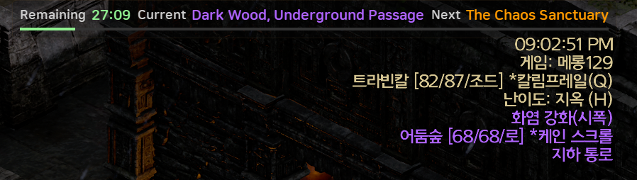
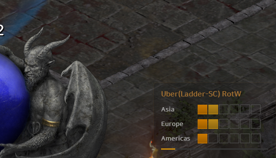

### 2. Buff Overlay & Profile Management

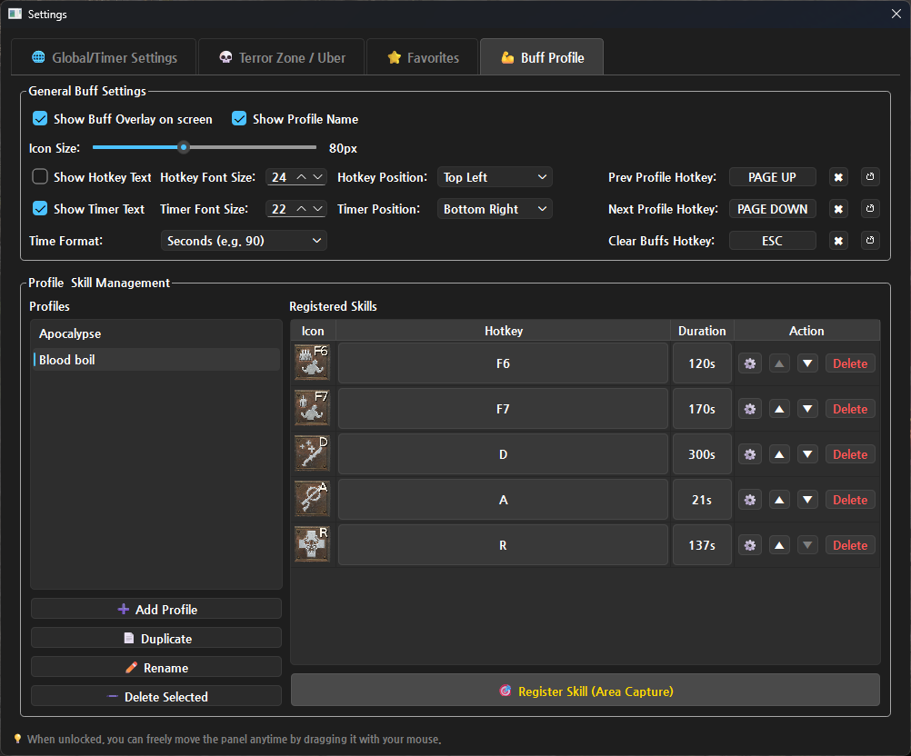
> Capture any skill icon directly from the game screen to set up and manage your own buff durations. Group your skills by profile for different characters or builds using the intuitive settings UI.

### 3. Real-time Item Search Dictionary
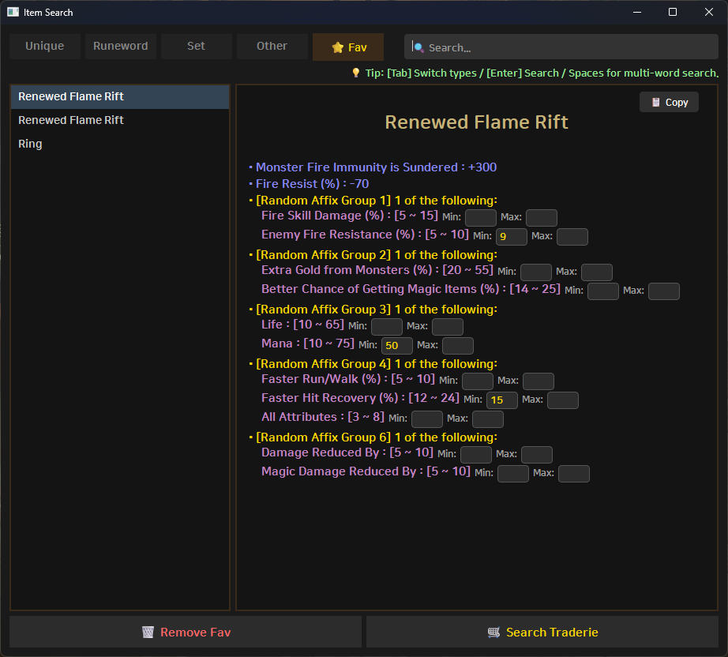
> Instantly search for Unique/Runeword items, base materials, aliases, and check their market value on Traderie without tabbing out of the game.

### 4. Speedrun Timer
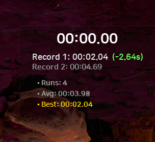
> Intuitively compare and record how much your clear time has improved after changing your equipment or builds.

---

## 🚀 Getting Started

### 1. Download & Preparation
1. Click the latest version in the **Releases** section on the right and download the **`.zip` file**.
2. Sign up/Login to [d2tz.info](https://www.d2tz.info/login) and copy your **API Key (Token)** from the User Profile page.

> **💡 How to keep your settings when updating:**
> * **Auto-Update (Recommended):** Simply click the **`⚡ Auto-Update`** button on the overlay when a new version is detected. It will safely download and install the update while preserving all your custom settings and profiles.
> * **Manual Update:** If you download the `.zip` file manually, copy and paste your old `d2_overlay_config.json` and `profiles` folder into the new version's folder.

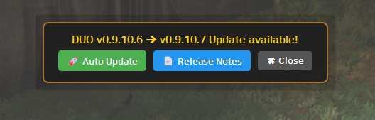
> 💡 When a new version is detected, the **`⚡ Auto-Update`** button appears at the top of the screen.

### 2. Run & Configure
1. Run **Diablo 2: Resurrected**. (Fullscreen Mode recommended).
2. Run `DUO.exe`. *(Run as administrator if your D2R client is also running as admin).*
3. Press **`Ctrl` + `Shift` + `S`** or right-click the system tray icon to open the **`⚙️ Settings`** window.
4. Paste your **API Key (Token)** into the settings and customize layouts, hotkeys, and features.

---

## ⌨️ Hotkeys

| Category | Hotkey | Function |
| :--- | :---: | :--- |
| **Global** | `Ctrl` + `Shift` + `S` | Open Settings Instantly |
| **Item Search** | `Ctrl` + `F` | Open Item Search Window |
| | `Tab` | (In Search) Toggle Unique / Runeword Tabs |
| | `↑` / `↓` | (In Search) Navigate Search Results |
| | `ESC` | Close Search Window |
| **Item Recognition** | `Ctrl` + `R` | Start capturing automatic item recognition area |
| **Buff Overlay** | `PageUp` / `PageDown` | Switch Buff Profiles |
| | User Defined Keys | Trigger Specific Buff Timer |
| **Speedrun Timer** | `Home` | Start / Pause Timer |
| | `End` | Record Complete (Save Lap Time) |
| | `Shift` + `Del` | Reset All Records & Stats |

---

## ✨ Key Features

**1. Real-time TZ & DClone Tracker**
* **Custom Favorite Alerts:** Get text blinks and sound notifications when your favorite zones are discovered and 5 mins before they start.
* **Uber Alerts:** Choose your expansion (LoD/RotW) and get notified when DClone stages increase.
* **Smart Polling:** Highly optimized API calls to prevent traffic waste.

**2. In-game Item Search Dictionary**
* **Powerful & Flexible Search Engine:** Search quickly and accurately by English/Korean names, **base items**, required runes, or well-known **aliases**. You can **use spaces to combine these keywords** to find exactly what you're looking for.
* **Seamless Traderie Integration & Custom Favorites:** Click the button to instantly open the item's market value page in your browser. If you input values for variable options, those exact stats are automatically applied as search filters on Traderie. **Furthermore, you can save these customized variable stats to your 'Favorites'. This allows you to easily check the live Traderie market price for those exact custom stats anytime with a single click from the Favorites tab, saving you the hassle of re-entering values.**
* **Advanced Favorites Management:** You can **right-click a favorite item to rename or duplicate it**. Also, you can modify the stats of an already registered favorite and click the **[💾 Save Opts]** button at the bottom to easily update the saved data.
* **Ultimate Convenience:** Instantly copy item details to your clipboard. The search window automatically becomes semi-transparent when it loses focus so it won't block your game view.

**3. Powerful Buff Overlay**
* **Profile & Skill Management:** Create, duplicate, and manage multiple buff profiles for different characters or builds. Register new skills effortlessly using the built-in screen capture tool to set hotkeys and durations.
* **Smart Buff Clear Ignore:** Prevent accidental buff timer resets. By registering keys like your inventory or party window hotkeys as 'Ignore if Prev Key', pressing your clear hotkey (e.g., ESC) to close those windows will no longer unintentionally reset your active buffs. (Supports auto-cancellation on double key presses)
* **Highly Customizable UI:** Adjust icon sizes, timer and hotkey text sizes/positions, and time display formats (seconds or MM:SS) to suit your preferences.
* **Custom Alerts:** Assign custom audio files (`.wav`, `.mp3`) placed in the `sounds` folder to individual skills, and configure specific volumes and flash alert thresholds.

**4. Speedrun Timer**
* **Record Comparison:** Optimized for measuring clear time variations due to equipment swaps or build changes. It intuitively displays the time difference (faster/slower) from the previous run using color-coded delta values.
* **Real-time Statistics:** Provides a clean, fixed-size UI that displays your current elapsed time alongside detailed stats such as total runs, average clear time, and your best record.

**5. UI & Convenience**
* **Click-through:** Mouse clicks pass right through the overlay.
* **Auto-Hide:** Automatically hides when switching to a browser or another app. Fully supports multi-client setups.
* **Free Layout:** Drag and drop panels anywhere. Vertical modes are also supported.
* **Auto-Update:** Notifies you of new versions with quick links to Release Notes and a 1-click update button.

---

## 💡 Custom Tips
* **Custom Fonts:** Place your font files inside the `fonts` folder, and they will be available for selection in the settings.
* **Custom Alert Sounds:** Place your desired audio files (`.wav`, `.mp3`) inside the `sounds` folder to use them as custom alerts.
* **Profile Sharing & Backup:** Custom buff profiles are saved in the `profiles` folder. While in-game duplication is supported, you can also copy this entire folder to easily back up your profiles or share them with others.

---

## 📂 File & Folder Descriptions

| File / Folder | Description |
| :--- | :--- |
| `DUO.exe` | Main executable file. |
| `act_map.json` | ⚠️ Essential TZ area level (Hell) and Act classification data (Do not delete). |
| `area.json` | ⚠️ Essential TZ translation data (Do not delete). |
| `d2_overlay_config.json` | Auto-saved user preferences (UI, fonts, volume). |
| `profiles/` | Folder containing your captured buff icons and `skills.json`. |
| `sounds/` | Place your custom `.mp3` or `.wav` files here for buff alerts. |
| `item/data/` | Database files (`.json`, `.tsv`) used for the item search dictionary. |
| `fonts/` | Default built-in fonts. You can add your own font files here. |
| `models/` | Folder where modules required for automatic item recognition are stored. |

---

> **⚖️ Open Source License Notice:**
> * This program dynamically links **PySide6**, which is licensed under LGPLv3. Due to the nature of single executable (`.exe`) distribution, if you wish to relink the library, please request the object files via the email provided below.
> * This program uses **Tesseract OCR** and **pytesseract** for text recognition on the game screen, which are licensed under the Apache License 2.0.

---

## 💻 Tested Environment & Troubleshooting

* **OS:** Windows 11 Pro 25H2 (64-bit)
* **Display:** 2560x1440 (QHD)
* **Game:** Diablo 2: Resurrected (Recommended: Fullscreen Mode)
* **Build:** Python 3.12 (PySide6)

**🛡️ Security & False Positives (Antivirus Blocks/Deletions)**
This program uses the `keyboard` module to detect your in-game hotkeys. Because keylogging-like behavior is common in malware, some antivirus software (like Windows Defender) may incorrectly flag and delete the file or block its execution. 
*(Easy Explanation: Intercepting keyboard input is a method frequently used by malicious programs, so it is a natural phenomenon for antivirus software to be suspicious and block it by default.)*

You may encounter false positive detection names such as:
* **Windows Defender:** `Program:Win32/Contebrew.A!ml` *(Easy Explanation: The '!ml' stands for Machine Learning. This means the antivirus AI flagged the file based on behavioral guessing rather than an exact virus signature match.)*
* **Other Antivirus Software:** `Gen:Variant.Adware.Tedy.8867`, etc.

If the program won't run or the executable file is deleted automatically, please try the following steps:

1. **Add to Exclusions (Recommended):** Add the extracted DUO folder to your antivirus **exclusion/exception list**.
2. **Disable Smart App Control:** If you are using Windows 11, you may need to turn off **Smart App Control** if it blocks execution.
3. **Run from a Trusted Directory:** Creating a folder and running the program from within `AppData/Local` or `Program Files` instead of your Desktop/Downloads folder can sometimes reduce the chances of false positives as they are standard system directories.
4. **Star the GitHub Repo:** Leaving a Star ⭐ on this GitHub repository helps build the software's reputation metric over time, which may help reduce false positives from reputation-based filters like Windows SmartScreen.

---

## ☕ Contact & Support

### 💡 Bug Reports & Feature Requests (Feedback)
If you encounter any **bugs** or have ideas for **new features**, please feel free to let me know using the methods below!
* **GitHub Issues (Recommended):** Please leave a post on the [GitHub Issues page (Click)](https://github.com/ggeonu-abi/D2RUO/issues) for the fastest response and organized tracking.
* **Email:** If you are not familiar with GitHub, you can always send an email to `miabohoja1@gmail.com`.

### ☕ Support (Donation)
**This program is 100% free to use for everyone!**
However, if you found this tool helpful for your gameplay and wish to support its ongoing development, you can optionally buy the developer a coffee. Your support is always greatly appreciated!

* [👉 Buy me a coffee via PayPal (For non-Korean users)](https://paypal.me/haruyozzang/4)

> Please scan the QR code below using your smartphone's camera!

---

<a href="https://lifemoneyhub.com">D2RUO</a> © 2026 by <a href="https://lifemoneyhub.com">Vellen</a> is licensed under <a href="https://creativecommons.org/licenses/by-nc-nd/4.0/">CC BY-NC-ND 4.0</a>

**Credits:** Data provided by [D2TZ.info](https://www.d2tz.info/)